# Conversafe 💬

An open-source platform to make language learning fun and easy, entirely for free! Have a nice conversation with other users or even AI, along with many other features!

> [!NOTE]
> This demo version still doesn't work with websockets(I am still working on fixing it), so the chat system and AI system won't work:(
> Also  the translation isn't working cause I need to setup CORS headers and stuff, I am working on that too.

## Demo ✨ 
Its live [here](https://conversafe.hackclub.app)

## Screenshots 📸

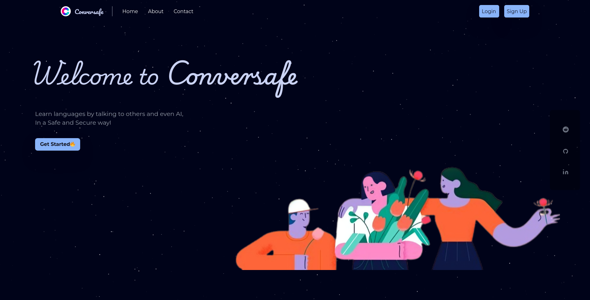

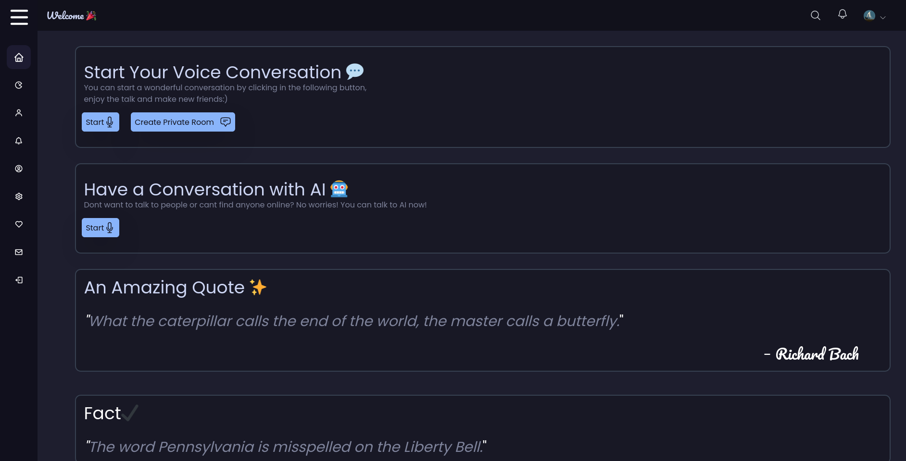

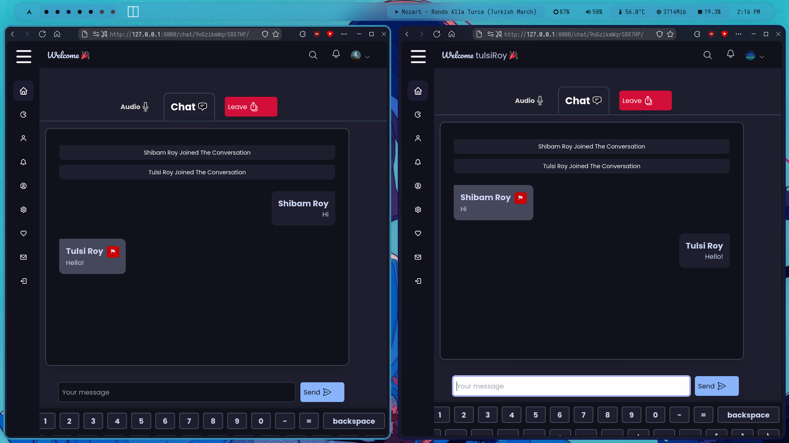

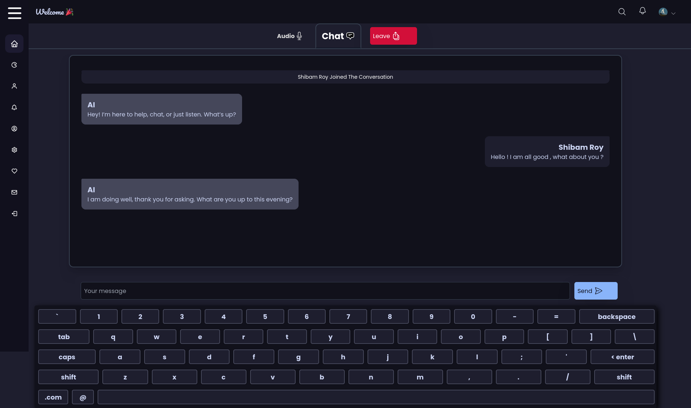

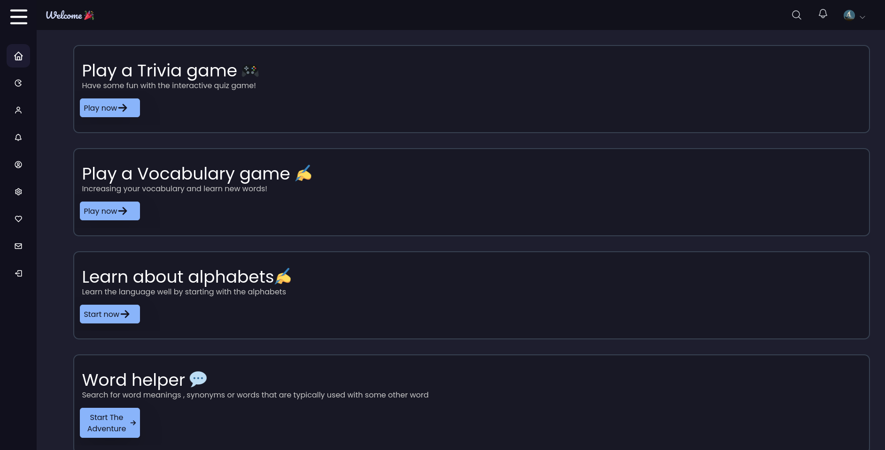

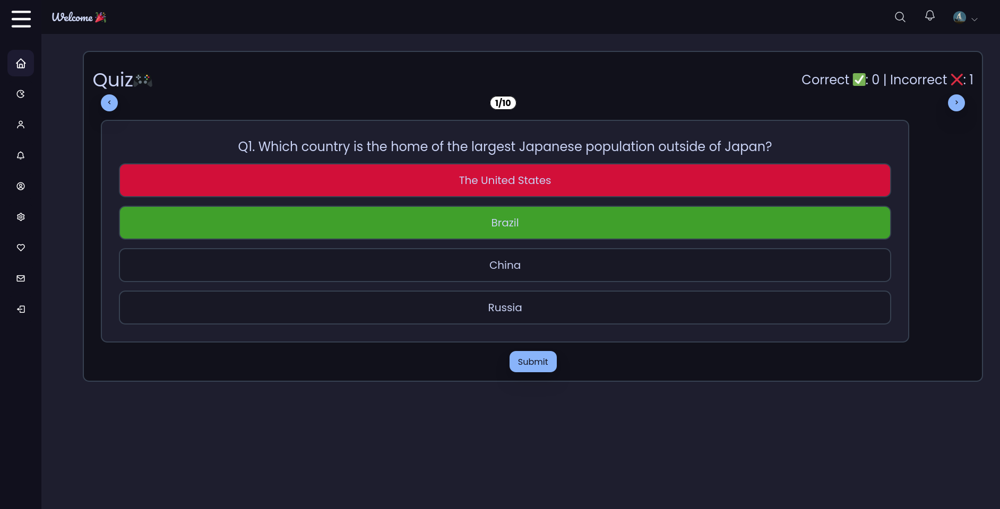

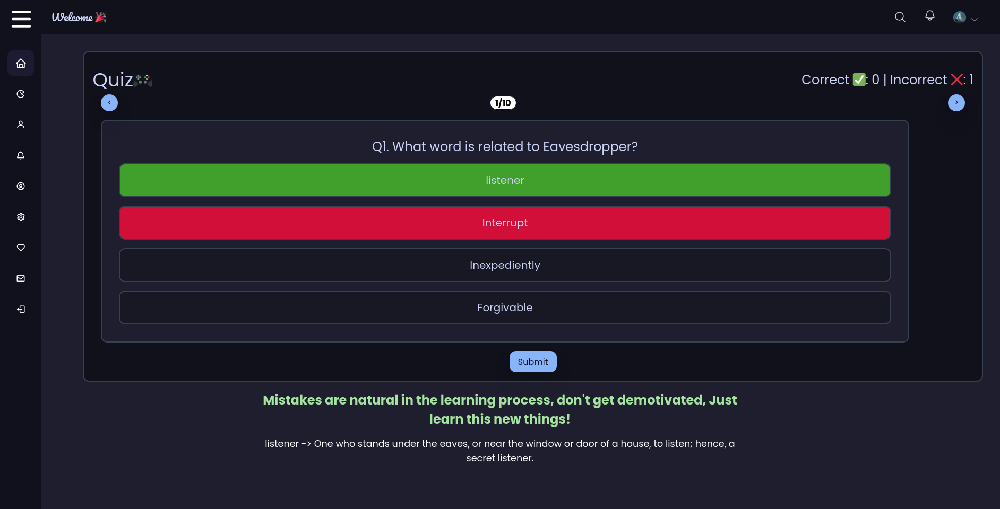

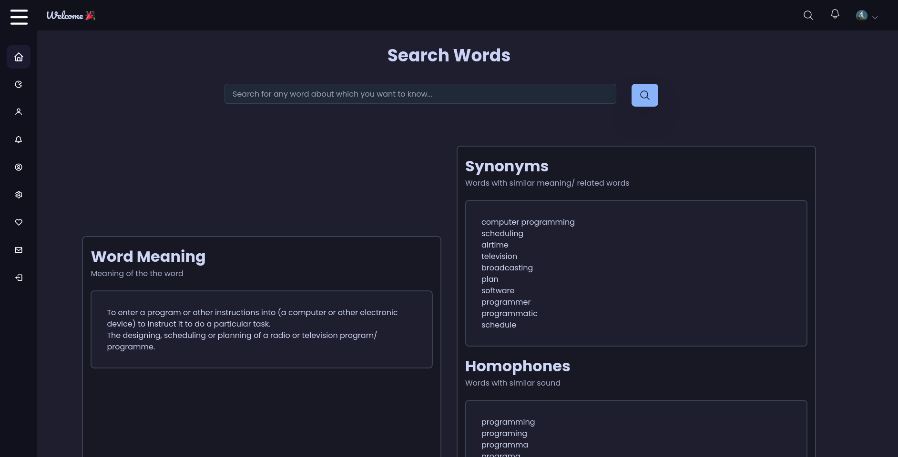

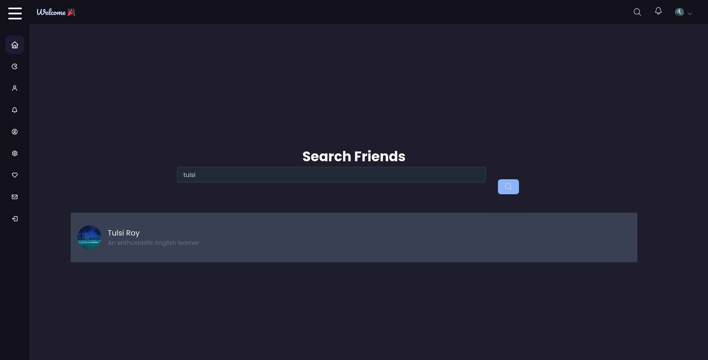

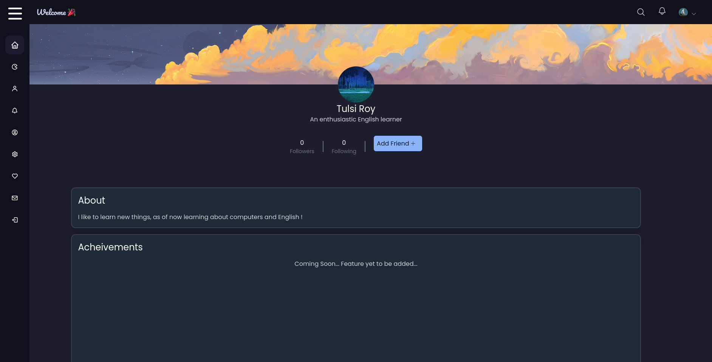

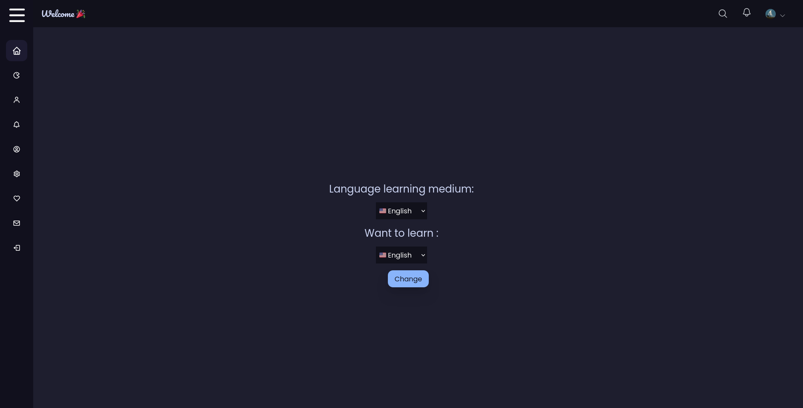

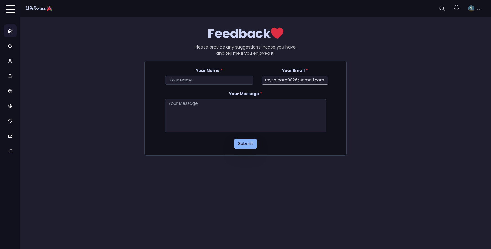

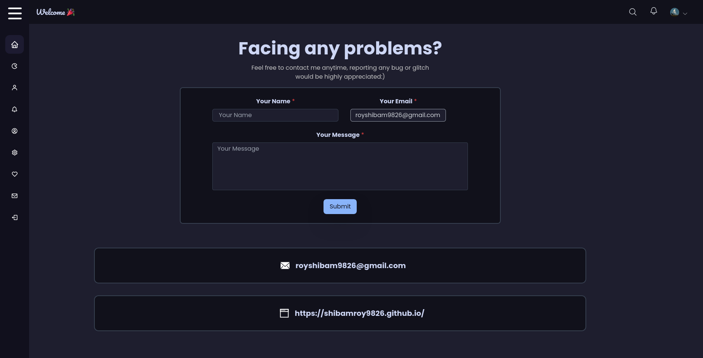


## Features 😎

-  Conversation with real peole (other learners)
-  Conversation with AI in absense of other users
-  Multiple languages(English,Hindi,Bengali,German,and Spanish)
-  Fun general knowledge quizzes, and Vocabulary quizzes
-  A word helper, something like a dictionary, but with more things like synonyms, phonetics etc.
-  Random Quotes, and Fun facts
-  Remain upto date with the platform using notifications
-  Friends system, so that users can make new friends
-  Catppuccin based dark theme by default
-  Extremely user-friendly UI
-  Fully free and open source

## Language support🗣️

As of now, these are the languages which are supported:

- English
- Hindi
- Bengali
- Spanish
- German

## Usage guide 🛠️

> [!NOTE]
> Email verification is broken as of now(In the hosted version), I am still trying to fix it...
> So some steps in the middle may not be required anymore.

1. This is the landing page of the website, click on the signup button at the top-right to create a new account.( Press on login if you already have an account)


2. Fill your details in the form

3. Click on the create account button

4. Once you've created your account, click on the login button. And fill in the details you've used to create your account.

5. Done! Now you're logged in and you can explore the rest of the website, its pretty user-friendly.
 If you don't understand the language, Click `Settings icon > Language learning medium > Change to any language you want(Out of the ones that are supported)`

## How is it made?

Its a [Django](https://www.djangoproject.com/) web app, and I used [TailwindCSS](https://tailwindcss.com/), and some vanilla CSS to design the frontend.
The chat system is built using websockets, there are different chat rooms which are created if there are no free active user pairs, if there already exists any active user waiting in an empty chatroom, the user is automatically paired with them. There's also a custom keyboard which is used so that users are easily type even when in a larger screen without having to worry about the system keyboard layout. This keyboard is made using [simple-keyboard](https://github.com/hodgef/simple-keyboard).

Each time the user logs in and gets to the dashboard, there's a random quote and a fact in the language that the user wants to learn. The quotes are fetched from a local database, while the facts are fetched using an api called the [Useless facts API](https://uselessfacts.jsph.pl/). The support for other languages is actually made by translating sentences, which is made possible by [LibreTranslate](https://github.com/LibreTranslate/LibreTranslate)

The AI feature uses [Blenderbot 400M Distill](https://huggingface.co/facebook/blenderbot-400M-distill) , an open-source project developed by Meta, its not too accurate as of now, but accurate enough for basic conversation. I am using it because its pretty lightweight.

There's also a word finder functionailty which uses a local database and the [Datamuse API](https://www.datamuse.com/api/) for phonetics and similar words.


## Installation/Running Locally 🛠️

Running this project locally is not very complicated.

1. Start by cloning this repository

```bash
  git clone https://github.com/ShibamRoy9826/Conversafe.git
```
2. Get inside the Conversafe directory

```bash
  cd Conversafe
```

3. Install necessary dependencies (Its suggested to make a virtual environment to run the project. Recommended Python Version : 3.10.5 )
 You should also have npm installed.
```bash
  pip install -r requirements.txt
```
4. Install TailwindCss

```bash
npm init -y
npm install -D tailwindcss
npx tailwindcss init
```

5. Set a few Environment variables,
You need to start by generating a key, run `python` and type this:
```python
>> import secrets
>> print(secrets.token_urlsafe(50))
```
Copy the generated token and paste it in the next command:
```
export CONVERSAFE_SECRET_KEY="<your_token_here_without_quotes>" # Required
```

5. To Run the server

```bash
python manage.py runserver
```

6. To Run Tailwind CSS
```bash
npm run dev
```

7. To run the language translation server
```bash
libretranslate --load-only en,es,de,bn,hi
```
This step will require some time when run it for the first time, as it will download all the translation models for these languages

8. Now you can visit https://127.0.0.1:8000 to view the application :)

## Todo list
- [x] ~~Integrate Catppuccin color palette~~
- [x] ~~Add a multiple languages~~
- [x] ~~Add a letter learning features~~
- [x] ~~Add a Word helper~~
- [x] ~~Add a Vocubarry quiz~~
- [x] ~~Write a few things to make the code better~~
- [ ] Fix websocket problems in hosted version
- [ ] Fix CORS header problems in hosted version
- [ ] Add a better LLM
- [ ] Add more themes
- [ ] Create something like posts, to make it somewhat like a social media platform maybe...
- [ ] Make a video scrolling section, so people can watch educational shorts
- [ ] Make it resposive

## FAQ ❔

### 1. Why Conversafe? There are other language learning apps too!

Yes, there are indeed many other applications which offer language learning for free, but Conversafe is an open-source alternative to that! and along with that it provides more practical interaction between the users so that they can learn better!

### 2. What's the point of using the AI feature? I can just have a conversation with ChatGPT or Gemini, they are far more accurate!

While they may be far more accurate, they also collect your data. Your responses are used to train the model itself, but incase of Conversafe, it uses [Blenderbot 400M Distill](https://huggingface.co/facebook/blenderbot-400M-distill) which is another open-source project made by Meta. Its a little lightweight, and that's why its being used in this application, but If I find any better open-source alternative I would definitely shift to that. You can suggest any model either by raising an issue in this github repository.

## Contributing 🤝

Everyone is welcome to contribute to the code!
You can also raise an issue, or suggest any features that you think would be great :)

> ✨ Please star this repository if you liked this project 😁
